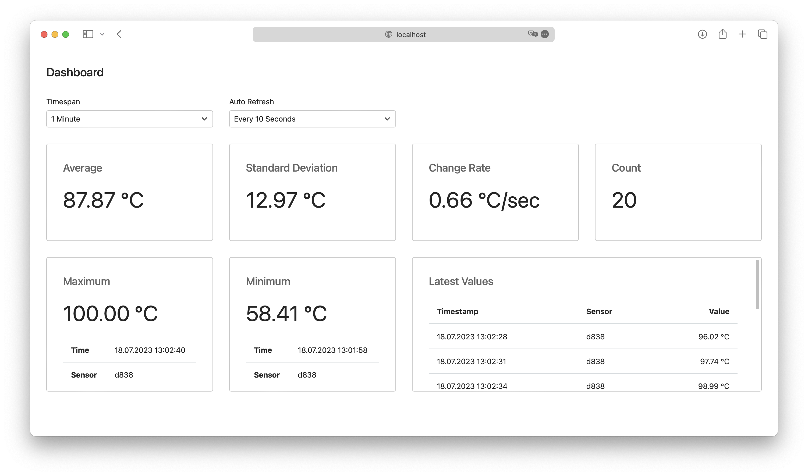

# iot-scenario

## Receiver

Usage of Receiver:
```
  -connectionString string
        Connection String to connect to MySQL
  -port int
        The port the receiver is listening on (default 8080)
```

Open the dashboard under `/statistics`.


## Sensor

Usage of Sensor:
```
  -id string
        id of the sensor (default "efe0")
  -interval int
        interval between sending data in seconds (default 3)
  -max float
        maximum value the sensor can report (default 100)
  -min float
        minimum value the sensor can report
  -random
        send random values
  -url string
        url of the receiver (default "http://localhost:8080")
  -wave
        send values following a wave function (default true)
```